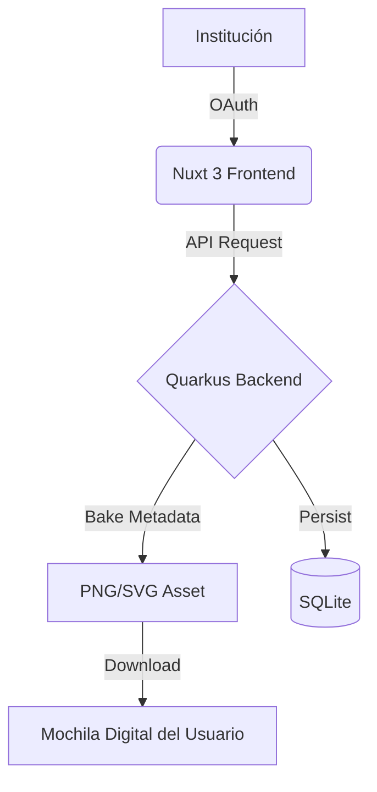

# Arquitectura del Sistema

La plataforma de **Open Badges Platfom** está diseñada bajo un modelo de arquitectura desacoplada, priorizando la portabilidad, la seguridad de los datos y el cumplimiento de estándares internacionales de insignias digitales.

## Vista General

El sistema se divide en tres capas principales que permiten una escalabilidad sencilla y un mantenimiento independiente:

### 1. Frontend (User Interface)
Construido con **Nuxt 3**, se encarga de la experiencia del usuario, la gestión de sesiones mediante OAuth 2.0 y la visualización de las insignias. Es una Single Page Application (SPA) optimizada para ser ligera y rápida.

### 2. Backend (Core Engine)
Desarrollado en **Quarkus**, es el corazón del sistema. Maneja la lógica de negocio, la comunicación con los servicios de Google para la identidad y, lo más importante, el proceso de **Image Baking** (incrustación de metadatos en las insignias).

### 3. Persistencia y Almacenamiento
* **Base de Datos:** SQLite (para una gestión simplificada en entornos comunitarios).
* **Storage:** Almacenamiento local para los assets de imágenes originales y procesadas.

## Flujo de Emisión Directa

A diferencia de sistemas de auto-reclamación, el flujo está diseñado para que el organizador de la institución (ej. GDG Guadalajara) sea el facilitador del reconocimiento:

1.  **Acceso Administrativo:** El organizador de la institución se autentica mediante Google OAuth.
2.  **Identificación del Receptor:** Se ingresan los datos de los miembros de la comunidad (correo) que ha obtenido el logro.
3.  **Generación de la Assertion:** El sistema genera el JSON-LD firmado que describe el logro, el emisor (ej. GDG Guadalajara) y el receptor.
4.  **Baking (El Horneado):** El backend toma el asset visual original e inyecta la información técnica en los metadatos de la imagen.
5.  **Entrega:** El sistema disponibiliza la imagen "horneada", la cual es un certificado digital autónomo que el usuario puede portar en su mochila digital.

---

## Decisiones Tecnológicas

| Tecnología       | Rol        | Razón de elección                                                             |
| :--------------- | :--------- | :---------------------------------------------------------------------------- |
| **Quarkus**      | Backend    | Bajo consumo de memoria y capacidad de compilación nativa (GraalVM).          |
| **Nuxt 3**       | Frontend   | Excelente manejo de SSR/Static y ecosistema de componentes Vue moderno.       |
| **Open Badges**  | Estándar   | Garantiza que las insignias sean compatibles con mochilas digitales externas. |
| **Contenedores** | Despliegue | Facilita la portabilidad entre diferentes entornos de infraestructura.        |

---

## Consideraciones de Seguridad

* **Identidad:** No almacenamos contraseñas; delegamos la identidad totalmente en Google.
* **Integridad:** Las imágenes SVG/PNG son procesadas para evitar la inyección de scripts maliciosos durante el proceso de *baking*.
* **Privacidad:** Solo se solicitan los alcances (scopes) mínimos necesarios: nombre y correo electrónico.